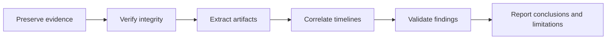

# Digital Forensics Investigation Portfolio

Sanitized case studies demonstrating evidence handling, artifact analysis, timeline reconstruction, network forensics, and technical reporting.

## Investigation workflow

## Case studies

| Investigation | Primary techniques |
| --- | --- |
| [Data Leakage Investigation](case-studies/data-leakage-investigation.md) | Hash verification, disk artifacts, removable-media activity, timeline analysis |
| [Rhino Hunt](case-studies/rhino-hunt.md) | Disk and network forensics, FTP/HTTP analysis, recovery, steganography |
| [Email and Mobile Artifacts](case-studies/email-and-mobile-artifacts.md) | Email headers, browser artifacts, application data, Autopsy, ALEAPP |

## Skills demonstrated

- Evidence integrity and hash verification
- File carving and deleted-file recovery
- Windows Registry, MFT, browser, and filesystem artifact analysis
- Timeline reconstruction and network forensics
- Email and mobile-device artifact examination
- Evidence-based reporting and documentation of limitations

## Evidence policy

Only sanitized narrative case studies are published. Disk images, packet captures, recovered files, email datasets, passwords, personal information, Autopsy databases, and course-provided evidence remain excluded.

## How to review this portfolio

This repository is intentionally documentation-only. Review the linked case studies for a consistent investigation structure: scenario, evidence sources, methodology, supported conclusions, limitations, and responsible-publication decisions. Reproduction requires the original controlled course evidence, which is not redistributed.

## About the author

Built by **Ahmed Balde** as a responsible, sanitized digital-forensics portfolio. See more cybersecurity, networking, Python, and engineering work on [GitHub](https://github.com/fetachino).
